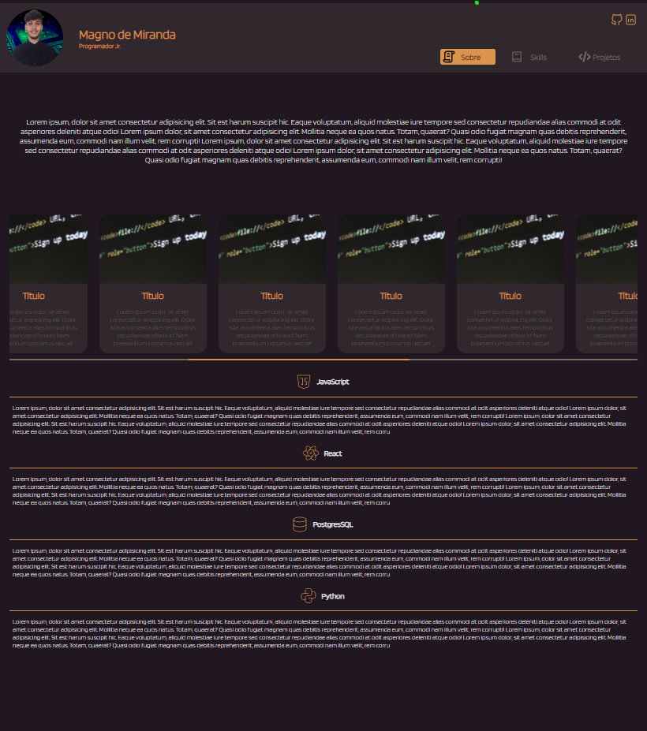
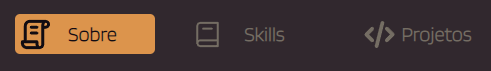
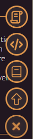
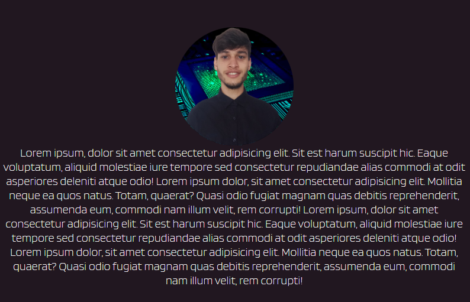
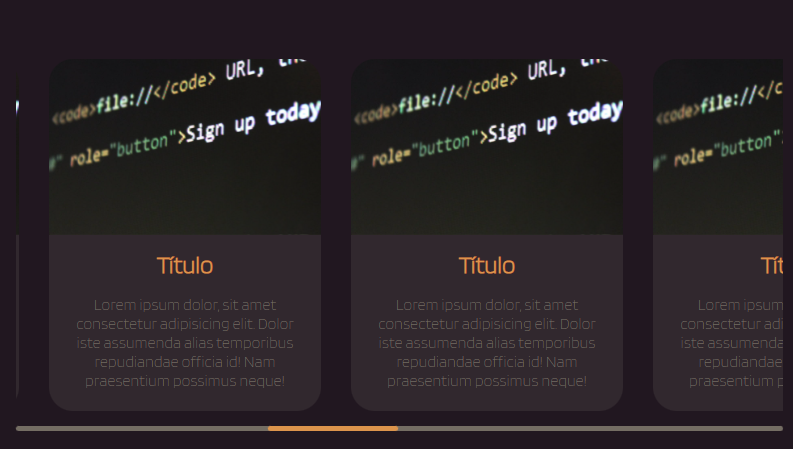
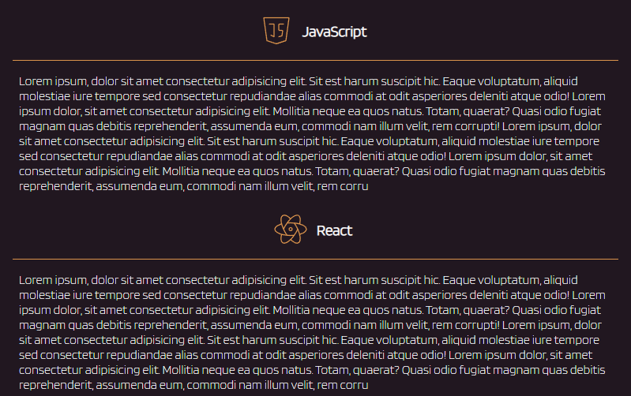

<h1 style="text-align: center;">Portifólio</h1>

<h2>Índices</h2>

<a href="https://magnomf.github.io/portfolio/">Link página do projeto</a>

<a href="#navegacao">Navegação na página</a>

<a href="#sessoes">Sessões da página</a>

<a href="#sobre">Sobre o Projeto</a>

<h2>Foto Projeto inteiro</h2>

<h2 id="navegacao" style="text-align: center;">Navegação na página</h2>

Há duas maneiras de navegar rápidamente pela página, uma delas é utilizando os botões da navbar, ao clicar neles você é direcionado para a sessão.

A segunda forma é utilizando os botões no canto inferior direito, eles aparecem após o navbar desaparecer da tela.

<h2 id="sessoes" style="text-align: center;">Sessões da página</h2>

<h3>Sobre</h3>

A primeira sessão é onde conto um pouco sobre mim, como comecei na carreira de programador junior.

<h3>Projetos</h3>

A segunda sessão são projetos que fiz,  ainda não tenho muitos. 
Dos projetos que fiz na empresa não são publicaveis... então irei fazer alguns para testar meus conhecimentos e deixar no portifólio

<h3>Skills</h3>

Esta sessão conto um pouco do que aprendi de cada linguagem/framework. Espero que essa lista aumente cada vez mais...

<h2 id="sobre" style="text-align: center;">Sobre o Projeto</h2>

Neste projeto foi feito utilizando  React.js,   CSS e  HTML.

Um dos motivos para escolher React é que estava utilizando em alguns projetos para empresa e queria colocar em prática o que ja havia aprendido em prática o que já havia aprendido em teoria.

É a primeira vez que utilizo o método BEM para CSS, achei facil de compreender e utilizar, acredito que vou tomar como padrão para os proximos projetos pela facilidade de compreender o CSS que está sendo utilizado na página.

Uma das proximos atualizações para esta página que gostaria de implementar é o usuário poder escolher entre tema claro ou escuro, ou até mesmo ter mais de duas opções de tema. Também colocarei titulo nas sessoes, no inico não parecia ser tão relevante já que quando se clica no botão ele direciona exatamente para a parte desejada, mas para quem irá rolar a página até o final fica sem sentido.

Já que a maior parte dos usuários utiliza mobile o projeto já está preparado para ser aberto em mobile e o layout se adapta, fiz o teste com várias proporções de tela e todas ficaram com o mesmo padrão.

